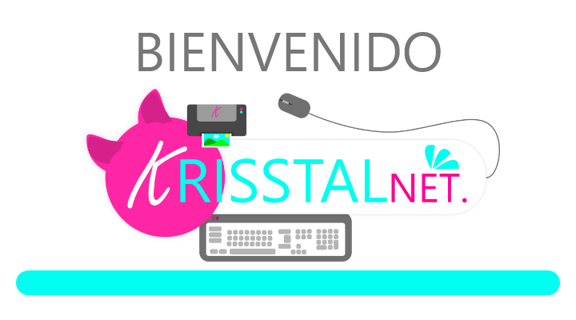
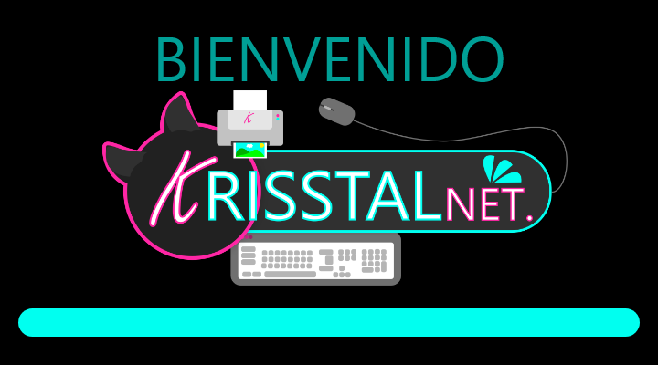
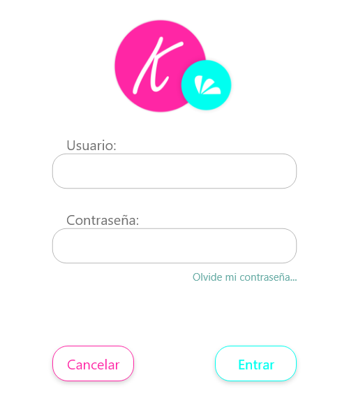
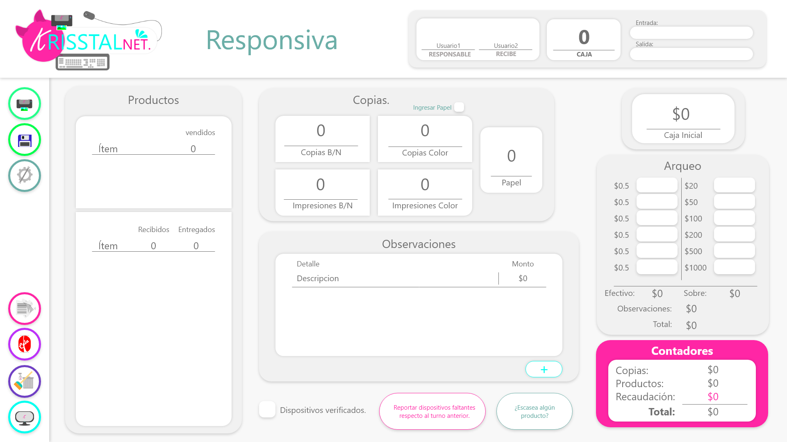

# KRISSTALNET

Punto de ventas para la sucursal KrisstalNet.

## Enfoque

Brindar una facilidad de uso multiplataforma mediante un diseño moderno inspirado en el diseño Material con React y Electron.

## Capturas

## Tecnologías usadas 🛠️

Lenguaje de programación **JavaScript y Go**

Interfaz GUI **HTML/CSS ReactJS**

Base de Datos **MongoDB**

API **Go GraphQL**

Otros **Redux**

### Pre-requisitos de compilación 📋

NPM
Electron
Go
MongoDB

### Instalación 🔧

--
--

## Autor ✒️
**LuisFlahan4051**
https://github.com/luisflahan4051

## Licencia 📄

GNU GPL.
